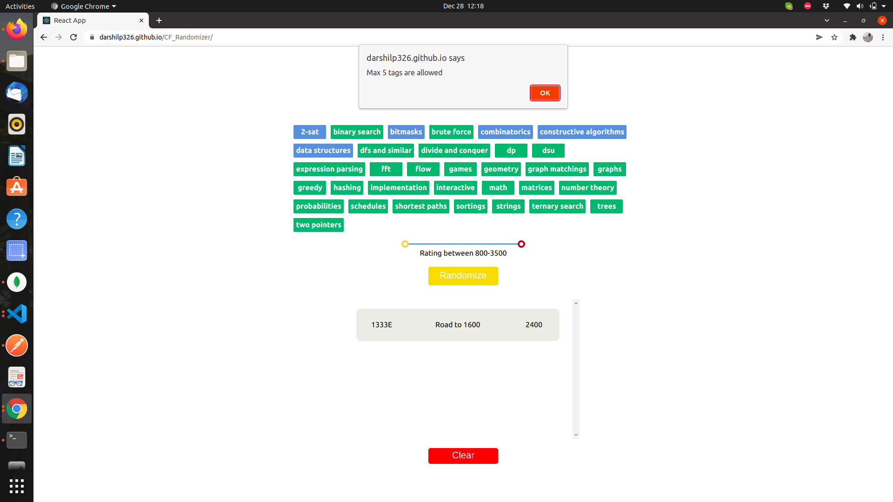

# Codeforces Problem Randomizer

## Description:
A codeforces problem will be randomized according to the topics selected by the user. 

## Technologies used:
Built using React, Styled Components, Axios, Codeforces Public API.

deployed at: http://Darshilp326.github.io/CF_Randomizer

### Show some :heart: and :star: the repo to support the project

## How it works

- Select topics from the provided list (max 4).

- Adjust the range of ratings to your likings.

- Press `Randomize` to retrieve a random problem from Codeforces based on your inputs.

 

 
 

 

## Features

[✓] Ratings adjustment

[✓] All current Codeforces topics included

[✓] Automatically saves history local storage

[✓] Clear history on demand

## Further plans

- Connect the website with the user's codeforces account for checking if the user has solved a certain problem or not.
## Contribution

Feel free to to suggest further features/improvements by opening an issue or by submitting a pull request.